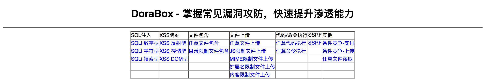

# co0ontty's Box 

掌握常见漏洞攻防，快速提升渗透能力

界面很丑，学过前端，但是懒得去搞了，希望谅解。

co0ontty's Box 的组成部分：


1.MySQL数据库(pentest.sql 导入到MySQL中即可)

**db_name:pentest**

| table_name | column_name                              |
| ---------- | ---------------------------------------- |
| account    | Id(int11),rest(varchar255),own(varchar255) |
| news       | id(int11),title(varchar45),content(varchar45) |

2.PHP

- conn.php 数据库配置文件
- class/function.class.php 核心功能文件
- 其他的差不多是咸鱼(开个玩笑)

大部分的功能实现是借助如下成员方法：

```php
public function con_function(){
	//自己造的回调
	$func_array = func_get_args();
	$name = func_get_arg(0);
	array_shift($func_array);
	echo "<hr>";
	return call_user_func_array($name,$func_array);
}
```


3.集合的漏洞类型：（这里的限制是只可以绕过）

- SQL注入：数字型、字符型、搜索型
- XSS：反射型、存储型、DOM型
- 文件包含：任意、目录限制
- 文件上传：任意、JS限制、MIME限制、扩展名限制、内容限制
- 代码/命令执行：任意
- SSRF：SSRF（回显）
- 其他：条件竞争（支付&上传）、任意文件读取
- CSRF：这里我没有写，因为没有什么必要，当时讲课的时候是想到完全可以结合其他的漏洞类型讲解

除此之外还有一些poc、exp在项目中，自己发现咯~
